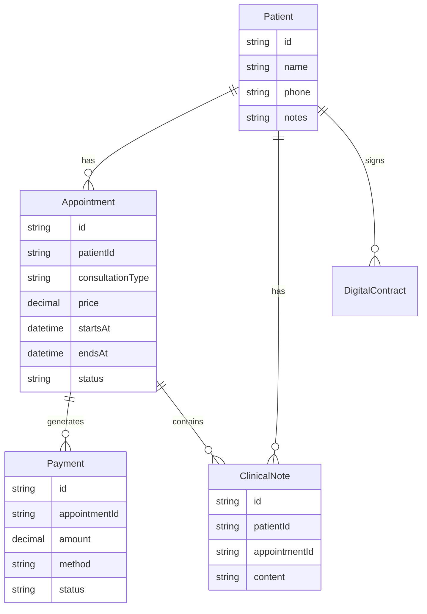

# Arquitetura Inicial - PsicoAgenda

## Stack Recomendada

- Frontend: React (projeto atual em `src`)
- Backend: Node.js + Express (projeto em `backend/src`)
- Banco: PostgreSQL com Prisma (`backend/prisma/schema.prisma`)
- Integracoes planejadas:
  - Google Calendar API (sincronizacao de consulta)
  - Provedor de assinatura digital (fase 2)
  - Emissao de nota fiscal (fase 2)

## Modulos

1. Agendamento
   - Agenda diaria, semanal e mensal
   - Sessao com duracao editavel
   - Bloqueio de conflito de horarios
   - Confirmacao de presenca/falta/cancelamento
2. Prontuario
   - Registro por sessao e por paciente
   - Acesso restrito ao psicologo
3. Financeiro
   - Sinal de 50%
   - Multa de cancelamento de 50%
   - Controle de forma de pagamento
   - Relatorio mensal de lucro

## Diagrama ER (MVP)

